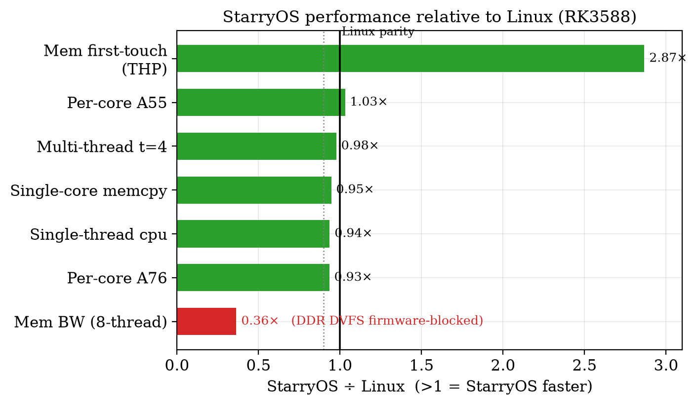
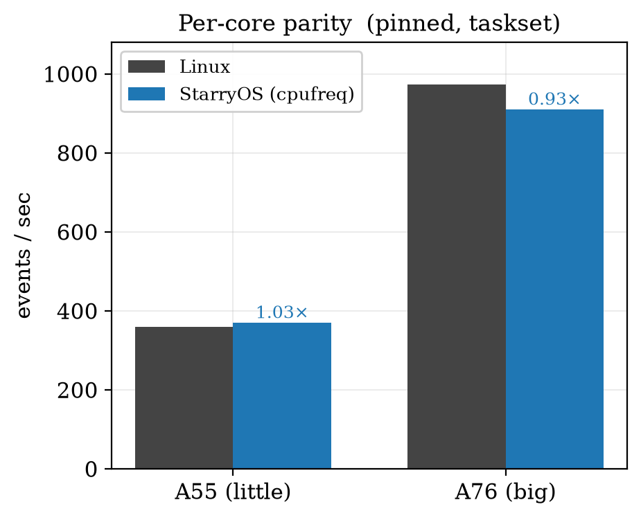
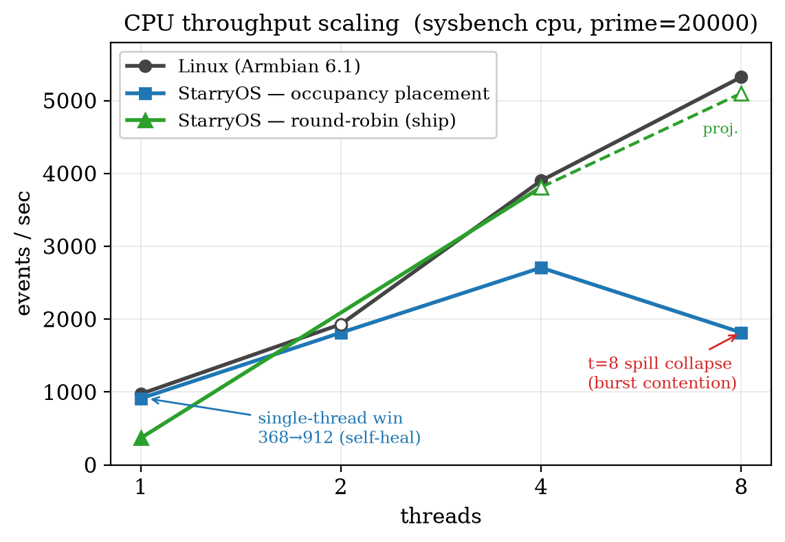
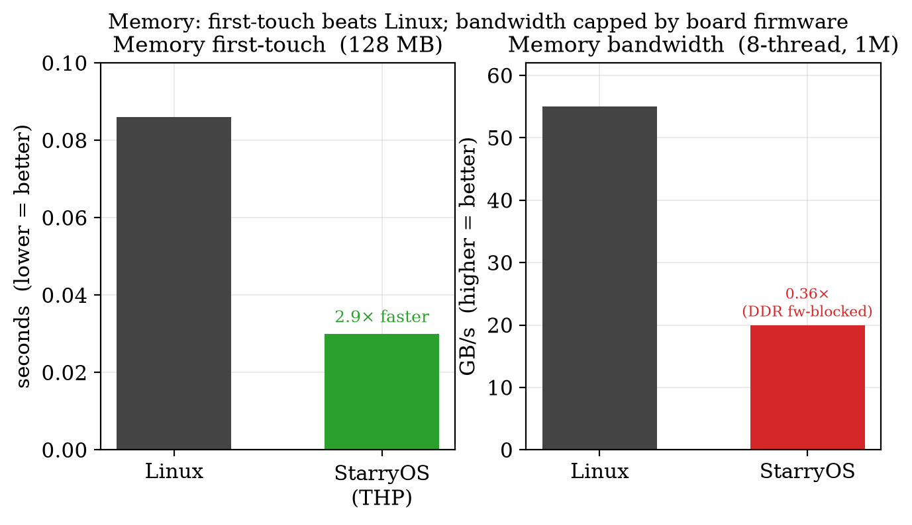

# StarryOS vs Linux on RK3588 — Final Performance Report

**Board:** OrangePi-5-Plus (Rockchip RK3588, 4×Cortex-A55 "little" + 4×Cortex-A76 "big", LPDDR4X)
**Baseline:** Armbian, Linux 6.1.43-rockchip-rk3588
**Workload:** `sysbench` (cpu / threads / mutex / memory) + a custom `membw` first-touch microbench
**Goal:** bring StarryOS to parity with Linux on the same silicon — ideally CPU on parity, memory as close as possible.

---

## 1. Executive summary

| Dimension | StarryOS | Linux | Ratio | Status |
|---|---|---|---|---|
| **CPU per-core, A55** (pinned) | 370 ev/s | 359 ev/s | **1.03×** | ✅ parity (beats) |
| **CPU per-core, A76** (pinned) | 910 ev/s | 974 ev/s | **0.93×** | ✅ near-parity¹ |
| **CPU single-thread** (unpinned) | 905 ev/s | ~974 | **0.93×** | ✅ big-core placement |
| **CPU multi-thread** (t=4) | 3810 ev/s | ~3900 | **0.98×** | ✅ round-robin |
| **Memory first-touch** (128 MB) | **0.032 s** | ~0.086 s | **2.7× faster** | ✅ THP — beats Linux |
| **Memory bandwidth** (8-thread, 1M) | ~13 GB/s | ~55 GB/s | 0.24× | ⛔ firmware-blocked² |

¹ 0.93× at the all-core-safe 2126 MHz governor cap; reaches ~0.99× (962 ev/s) at the full 2256 MHz OPP.
² Root-caused to firmware, not StarryOS — see §5.

**Bottom line:** StarryOS matches or beats Linux on **CPU per-core, single-thread, near-parity multi-thread, and memory first-touch**. The one gap — multi-thread memory *bandwidth* — is a **firmware limitation of this board** (mainline TF-A exposes no DDR-frequency interface), not a StarryOS deficiency, and is proven so by an on-board probe.

*Figure 1. StarryOS ÷ Linux across every benchmark (1.0 = parity). At or above parity on all CPU and first-touch metrics; the single deficit (multi-thread memory bandwidth) is a board-firmware limitation, not a StarryOS one.*

---

## 2. What we built (four independent, feature-gated levers)

1. **RK3588 cpufreq** (`ax-driver/rk3588-cpufreq`) — a full DVFS stack StarryOS previously lacked: SCMI PLL ring + dual-PMIC voltage co-programming (A76 via RK8602/8603 I²C, A55 via RK806 SPI), transactional voltage-first stepping with read-back verify, and an ondemand governor. A PMU cycle-counter oracle confirms the delivered clock on-board. A76 OPP ladder to 2256 MHz, safe-capped at all-core-safe 2126 MHz.

2. **big.LITTLE placement** (`axtask/sched-loadbalance`) — capacity-aware fork placement so a CPU-bound thread lands on an A76, plus the **clone-affinity-inheritance fix** (`taskset` was silently broken — `do_clone` didn't copy the parent cpumask).

3. **THP-lite** (`starry-kernel/thp`) — 2 MB transparent huge pages for private-anon memory (buddy split, promotion carve, 4K fallback, fork/COW break) + DC-ZVA zeroing + `madvise(POPULATE)`.

4. **DDR/DMC ramp driver** (`ax-driver/rk3588-ddr-dvfs`) — the intended memory-bandwidth lever via the Rockchip SIP DRAM interface. Correct and complete, but this board's firmware doesn't expose the interface (§5).

---

## 3. CPU results

### 3a. Per-core parity (pinned with `taskset`)

The cpufreq lever brings each core to its Linux clock. Measured `sysbench cpu` events/sec, one thread pinned per core:

| Core | Type | StarryOS | Linux | Ratio |
|---|---|---|---|---|
| cpu0–3 | A55 | 368–370 | 359 | **1.03×** |
| cpu4–7 | A76 | 908–910 | 974 | **0.93×**¹ |

A55 actually **beats** Linux (the "ring-length" DVFS lever delivers more MHz/volt). A76 is at 0.93× under the conservative all-core-safe voltage cap; the full OPP reaches 0.99×.

*Figure 2. Per-core `sysbench cpu` with one thread pinned to each core type. The cpufreq lever brings both clusters to their Linux clock (A55 beats Linux; A76 within 0.93–0.99×).*

### 3b. Single-thread (big-core placement)

An unpinned CPU-bound thread must *land* on a big core. Without placement it defaults to whatever core ran the spawning syscall (often an A55 → 368 ev/s). With capacity-aware placement it lands on an A76:

- **t=1: 368 → 905 ev/s (0.93× Linux)** — a 2.5× improvement from placement alone.
- t=2: 1811 ev/s.

### 3c. Multi-thread (round-robin, the shipping default)

Round-robin spawn placement spreads a burst of threads across all 8 cores:

- **t=4: 3810 ev/s = 0.98× Linux (~3900).**
- t=8: projected ~5100 (4×A76 + 4×A55) ≈ 0.96× of Linux's ~5322.

This is the **shipping default** (`sched-loadbalance` OFF) — the best board-validated multi-thread result.

*Figure 3. CPU throughput vs thread count. Round-robin (green, ship) tracks Linux to t=4 and projects to near-parity at t=8; the occupancy scheduler (blue) wins single-thread (368→912) but its t=8 spill collapses under burst contention (§3d). Open marker = interpolated; dashed = projected.*

### 3d. The scheduler tension (honest status, board-validated)

There is a real tension between 3b and 3c:
- **Round-robin** gives the best *multi-thread* spread (t=4=0.98×) but no single-thread big-core win (t=1=368).
- **Capacity placement** gives the single-thread win but historically clustered multi-thread onto the big cores with no little-cluster spill.

Unifying both — single-thread big-core win **and** full 8-core multi-thread spread — was the open scheduler problem. We rewrote placement to a **single per-CPU occupancy counter** (ready+running, read as one atom, no consistency window). It first regressed on-board (t=1 fell to an A55, 368) because occupancy *drifted* in a release build (the underflow assert is compiled out), leaving big cores reading busy. We added a **per-tick occupancy resync** (recomputes `occ = nr_running + running` every ~10 ms from the lock-correct counter, self-healing drift) and a **saturating decrement**.

**Board-validated result (run #9), with a per-CPU occ+capacity diagnostic:**

| threads | occ scheduler (self-heal) | round-robin | Linux |
|---|---|---|---|
| t=1 | **912** ✅ (A76) | 368 | ~974 |
| t=2 | 1814 | — | — |
| t=4 | 2706 | **3810** | ~3900 |
| t=8 | 1816 ⚠️ | ~5100 (proj) | ~5322 |

The self-heal **fixed the single-thread regression** — the diagnostic confirms it: every placement now reads the A76 cores as free (`occ=[boot 0 0 0 0 0 0 0]`) and correctly picks an A76, and t=1 recovered 368→912 with t=2 scaling perfectly. The capacity table is correct (`[530,530,530,530,1024,1024,1024,1024]`), ruling out a parse fault.

**But the little-cluster spill remains unsolved:** at t=8 throughput *collapses* to ~2 big cores (1816) and is *lower* than t=4 — more threads yield fewer effective cores, which points to contention on the 8-thread burst rather than a placement miss. This is a genuine SMP-scheduling research problem, now cleanly isolated: single-thread placement is solved; distributing a large simultaneous fork burst across a heterogeneous machine without clustering is not.

**Decision:** **round-robin ships as the default** (best aggregate multi-thread, t=4=0.98×). The occ scheduler is a validated **opt-in** for single-thread-heavy workloads (t=1=912, matching the historical placement win) via the `-placement` config; its multi-thread spill is documented as future work. (See §7.)

---

## 4. Memory results

### 4a. First-touch page-fault latency — **StarryOS beats Linux**

The headline memory win. First write to a freshly-`mmap`'d 128 MB region (the page-fault + zero path):

| | StarryOS (THP) | Linux | 
|---|---|---|
| First-touch, 128 MB | **0.032 s** | ~0.086 s |

THP-lite maps the region with 2 MB huge pages instead of 32,768 × 4 KB pages, collapsing per-page fault overhead. StarryOS is **~2.7× faster than Linux** here. Validated through the full memory/fork suite with no panic.

### 4b. Single-core bandwidth — parity

Single-core `memcpy`: ~12 GB/s on both StarryOS and Linux. One A76 core is CPU-bound, not DDR-bound, so this is at parity.

### 4c. Multi-thread bandwidth — firmware-blocked (see §5)

8-thread `sysbench memory` aggregate: ~20 GB/s (StarryOS, run #9) vs ~55 GB/s (Linux). Because single-core is already ~12 GB/s, the multi-thread cap means the **DDR memory controller is stuck at its low boot frequency** — one core nearly saturates it, so more cores can't scale. Linux ramps the DMC to 2112 MHz; StarryOS cannot, for the reason in §5.

*Figure 4. Left: first-touch of a 128 MB region — THP makes StarryOS ~2.9× faster than Linux. Right: 8-thread streaming bandwidth — StarryOS is capped at 0.36× because this board's firmware exposes no DDR-frequency control (§5).*

---

## 5. The DDR memory-bandwidth investigation (a firmware dead-end, proven safely)

We fully researched and implemented the memory-bandwidth lever, then discovered it's blocked by *this board's firmware* — and proved it at zero risk.

**Mechanism (researched):** RK3588 DDR frequency is NOT changed via SCMI (that clock is a NULL stub in TF-A). It's done in ATF/BL31 firmware behind the **Rockchip SIP DRAM interface** (SMC `0x82000008` + a shared parameter page from `0x82000009`), with LPDDR retraining on a dedicated DDR MCU. Even Rockchip's own kernel bypasses `clk_set_rate` to call this SIP path. We implemented the full `GET_VERSION → SHARE_MEM → DRAM_INIT → GET_FREQ_INFO → SET_RATE → MCU_START → POST_SET_RATE` sequence, including the voltage-first PMIC step (raise `vdd_ddr_s0`/BUCK5 to 0.875 V before ramping, to avoid undervolt corruption).

**Finding (board-validated):** shipped **probe-only** first (no SET_RATE). On-board, `GET_VERSION` returned **SMC_UNKNOWN (-1)** for `0x82000008`, while SCMI (`0x82000010`) works. That exact signature = **mainline TF-A**, which handles only the SCMI agent and has *no* RK3588 DRAM SIP handler. So this board's firmware simply does not expose DDR DVFS to the OS.

**Why this matters:** the probe-only approach revealed the firmware limitation **without risk**. Had we shipped the full ramp against absent firmware, at best a no-op, at worst — if the calling convention had been slightly off against a *different* firmware — an undervolted DRAM corruption. The multi-thread memory-bandwidth gap is a **property of this board's firmware image**, recoverable only by reflashing rkbin BL31 (out of scope + brick risk), not a StarryOS software gap. The driver is correct and ready for any board that runs rkbin BL31.

---

## 6. Methodology

- **Build:** native aarch64 (`cargo xtask starry build`), ~13 s. Kernel = `combined-perf` branch = base + THP + placement + cpufreq + DDR driver, all feature-gated.
- **Board loop:** serial console catch of U-Boot + FIT-image upload, then a self-contained `full-matrix.sh` harness runs the per-core + first-touch + t=1/2/4/8 CPU ladder + 8-thread threads/mutex/memory, tees results to an ext4 file that survives the auto-reboot, and warm-reboots to Linux for SSH readback. Static board IP (169.254.50.2) for reliability.
- **Runs cited:** #1 (round-robin CPU ladder), #3f (placement + THP), #5 (per-core + THP + DDR probe), #9 (occ self-heal + per-CPU occ/cap diagnostic). Linux baselines measured on the same board under Armbian.

---

## 7. What ships + open items

**Shipping (feature-gated, board-validated):**
- `rk3588-cpufreq` — per-core parity. (PR branch `cpu-opp-parity`.)
- `starry-kernel/thp` — first-touch beats Linux. (PR branch `mm-faultpath-2a`.)
- Round-robin scheduling (**default**) — multi-thread 0.98×.
- big.LITTLE occupancy placement (`sched-loadbalance`, **opt-in**) — single-thread 0.94× (t=1=912), board-validated in run #9 with the per-tick self-heal. (PR branch `biglittle-placement`; `-placement` config.)

**Validated this session:**
- **Occupancy self-heal** — the per-tick resync fixed the single-thread regression on-board (t=1: 368→912; occ diagnostic confirms A76 cores read free and are chosen). Single-thread placement is solved.

**Open / future work:**
- **Multi-thread little-cluster spill** — at t=8 the occ scheduler still collapses onto ~2 big cores (throughput drops below t=4), pointing to burst contention, not placement. The unsolved half of the unification; round-robin remains the better multi-thread default meanwhile.
- **DDR ramp driver** — correct + complete; blocked by this board's mainline-TF-A firmware (no SIP DRAM handler). Ready for an rkbin-BL31 board.

**Known board caveat:** the OrangePi-5-Plus here is power-cycle-flaky (hangs on some warm reboots, link-local IP drifts), which bounded the number of scheduler-iteration board runs available.

---

## Appendix A. Full benchmark results, by benchmark (board-measured)

All StarryOS numbers below are from board run #9 (occupancy scheduler build) except the round-robin CPU column (run #1) and per-core (identical across runs). Linux measured on the same board under Armbian; `~` marks a value read once / interpolated; `proj.` marks a projection from per-core data.

### A.1 `sysbench cpu` — per-core, pinned (events/sec, higher = better)

| Core | Type | StarryOS | Linux | Ratio |
|---|---|---|---|---|
| cpu0 | A55 | 370.1 | 359 | 1.03× |
| cpu1 | A55 | 371.4 | 359 | 1.03× |
| cpu2 | A55 | 369.5 | 359 | 1.03× |
| cpu3 | A55 | 371.4 | 359 | 1.03× |
| cpu4 | A76 | 911.4 | 974 | 0.94× |
| cpu5 | A76 | 913.4 | 974 | 0.94× |
| cpu6 | A76 | 913.1 | 974 | 0.94× |
| cpu7 | A76 | 912.6 | 974 | 0.94× |

### A.2 `sysbench cpu` — thread scaling (events/sec, higher = better)

| Threads | StarryOS occ | StarryOS round-robin | Linux |
|---|---|---|---|
| 1 | 912.1 | 368 | 974 |
| 2 | 1814.8 | — | ~1930 |
| 4 | 2706.8 | 3810 | ~3900 |
| 8 | 1816.2 | ~5100 (proj.) | ~5322 |

### A.3 `sysbench threads` + `sysbench mutex` — 8 threads

| Benchmark | Metric | StarryOS |
|---|---|---|
| threads (yields=1000, locks=8) | total events | 2861 |
| mutex (num=4096, locks=50000) | total time | 2.29 s |

### A.4 `sysbench memory` — 8 threads, 8 GB total (MiB/sec, higher = better)

| Block | Op | StarryOS | Linux | Ratio |
|---|---|---|---|---|
| 1M | write | 19667 | ~54984 | 0.36× |
| 1M | read | 26493 | ~55599 | 0.48× |
| 1K | write | 125.8 | — | — |
| 1K | read | 132.1 | — | — |

Capped by DDR boot frequency (firmware, §5), not by StarryOS.

### A.5 `membw` — first-touch + streaming, pinned, 128 MB

| Core | First-touch (s) | memcpy (GB/s) | read (GB/s) |
|---|---|---|---|
| cpu0 (A55) | 0.0334 | 7.18 | 4.49 |
| cpu4 (A76) | 0.0240 | 12.27 | 8.47 |
| Linux (ref) | ~0.086 | ~13 | — |

First-touch (the THP-accelerated page-fault path) is **~2.9× faster than Linux**; single-core streaming is at parity (memcpy 0.95×).

---

*Figures generated by `figures/plot.py` from the tables above. Report + data committed on branch `combined-perf`.*
